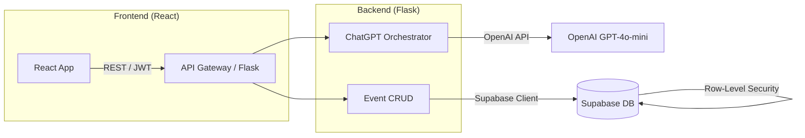

# AI Calendar – High-Level Architecture

1. **React Frontend** – provides calendar UI and chat interface, authenticates via Supabase Auth and calls Flask API with the user's JWT.
2. **Flask Backend** – exposes REST endpoints (`/api/events`, `/api/chat`, `/api/health`).
3. **ChatGPT Orchestrator** – takes user NL input, determines intent (create, reschedule, delete) and routes to Event CRUD layer.
4. **Supabase Postgres** – single source of truth. Row Level Security ensures every query is scoped to `auth.uid()`.
5. **OpenAI API** – GPT-4o-mini powers NL understanding.

> See `docs/API.md` for full endpoint reference. 